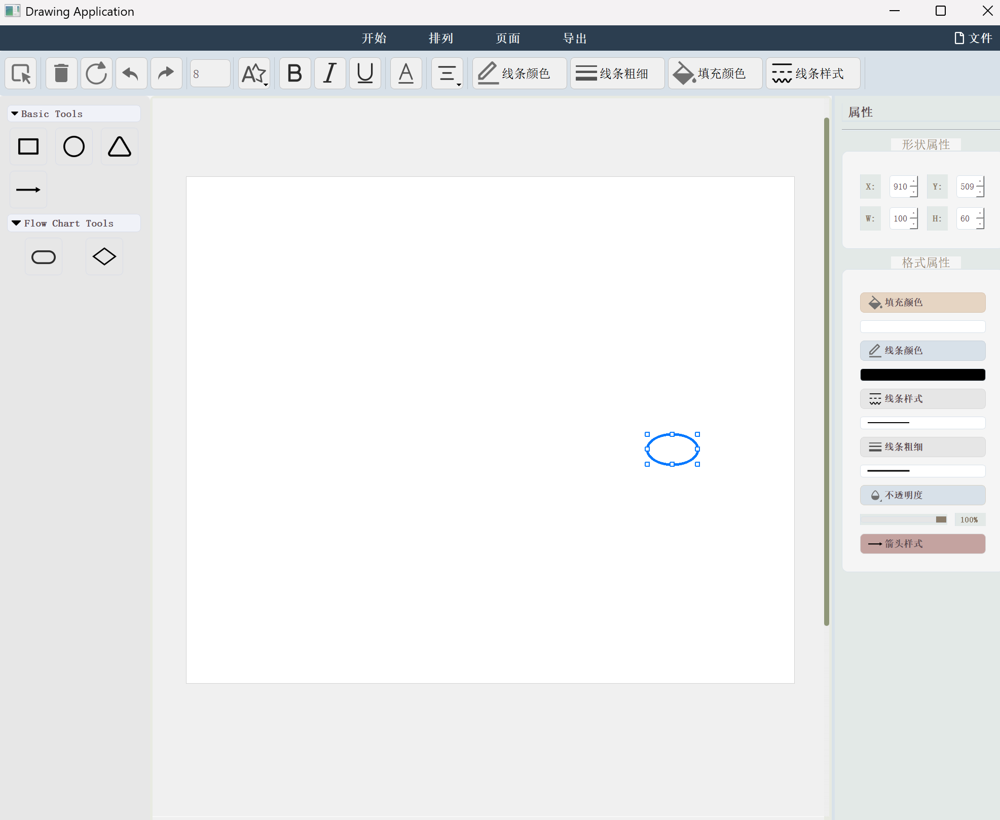

# QtDemo - 基于 Qt Widgets 的流程图编辑器

一个使用 **C++ / Qt5 Widgets / CMake** 实现的桌面流程图绘制工具，面向流程图、结构示意图和简单图形排版场景。

项目具备完整的图形绘制、属性编辑、页面控制、导入导出和基础编辑能力.

## 界面预览



## 项目简介

`QtDemo` 以单窗口编辑器为核心，使用 `MainWindow` 统一组织顶部功能区、左侧图形工具区、中央滚动画布和右侧属性面板。

用户可以从左侧工具栏拖拽或选择图形，在画布中创建节点与箭头，并继续进行文本编辑、颜色调整、线条样式设置、图层排列、页面缩放以及 PNG / SVG 导出。

## 已实现功能

### 1. 图形创建

- 支持基础图形：矩形、圆形、三角形、箭头。
- 支持流程图图形：开始/结束框、菱形。
- 支持从左侧工具区向画布拖放创建图形。
- 新建图形后自动加入当前选中状态。

### 2. 画布编辑能力

- 单选与多选。
- 拖拽移动图形。
- 控制点缩放图形大小。
- 旋转图形。
- 框选与批量操作。
- 删除选中图形。
- 支持复制、剪切、粘贴。
- 支持撤销 / 重做。

### 3. 文本编辑与样式设置

- 双击图形可进行行内文本编辑。
- 支持文本加粗、斜体、下划线。
- 支持文本颜色修改。
- 支持文本对齐设置。
- 图形内部文本会跟随图形一并管理。

### 4. 图形样式设置

- 填充颜色修改。
- 边框颜色修改。
- 线条样式切换。
- 线宽调整。
- 透明度调整。
- 箭头样式切换：无箭头 / 单箭头 / 双箭头。

### 5. 页面与视图控制

- 页面尺寸调整。
- 画布背景色修改。
- 网格显示开关。
- 网格吸附。
- 画布缩放。
- 画布居中。

### 6. 排列与层级管理

- 图形排列功能。
- 图层置顶 / 置底。
- 上移一层 / 下移一层。
- 对多个图形进行批量样式修改。

### 7. 文件与导出能力

- 新建画布。
- 打开 SVG 文件。
- 保存为自定义 `.flow` 文本格式。
- 导出 PNG 图片。
- 导出 SVG 文件。

## 核心逻辑说明

### 1. 数据模型

项目以 `Shape` 结构体作为统一图元模型，核心字段包括：

- `type`：图形类型。
- `rect`：图形位置与尺寸。
- `color` / `borderColor`：填充色与边框色。
- `penStyle` / `lineWidth`：线条样式与线宽。
- `rotation` / `opacity`：旋转角度与透明度。
- `text` / `textFont` / `textColor` / `textAlignment`：文本及其样式。
- `arrowStyle`：箭头类型。
- `sourceShapeIndex` / `targetShapeIndex`：箭头连接关系。

所有图形统一存储在 `QList<Shape> shapes` 中，编辑器的大部分功能都围绕这个列表展开。

### 2. 渲染逻辑

渲染核心由 `paintEvent()` 完成：

1. 遍历 `shapes`。
2. 根据图形状态设置画笔、填充色、透明度和选中高亮。
3. 按不同 `type` 分别绘制矩形、圆形、三角形、菱形、开始结束框、箭头与文本。
4. 若图形被选中，则附加绘制控制点、旋转手柄和特殊连接点。

这意味着界面显示结果本质上由 **图元数据状态** 决定，而不是每个控件自己保存显示状态。

### 3. 交互逻辑

编辑器的交互流程主要分为四类：

- **创建图形**：选择或拖拽工具 → 在画布落点生成新图形。
- **编辑图形**：选中图形 → 移动 / 缩放 / 旋转 / 改样式。
- **编辑文本**：双击图形 → 弹出内嵌 `QTextEdit` → 完成后写回图元。
- **连接箭头**：从图形特殊连接点出发绘制箭头，并记录源/目标图形索引。

### 4. 撤销重做逻辑

项目通过 `undoStack` 和 `redoStack` 保存图形列表快照，实现基础的历史记录能力：

- 每次关键编辑前调用 `saveState()`。
- `undo()` 从撤销栈回退上一状态。
- `redo()` 从重做栈恢复状态。

这种方案简单直接，适合当前规模的图形编辑器实现。

### 5. 箭头联动逻辑

当箭头与图形建立连接后，项目会记录箭头起点和终点对应的图形索引与控制点索引。

后续当节点移动、缩放或位置变化时，`updateConnectedArrows()` 会重新计算箭头端点位置，使连接关系保持同步。

### 6. 文件处理逻辑

- **打开文件**：当前实现主要支持读取 SVG 内容，并通过正则表达式解析 `<rect>`、`<circle>`、`<line>`、`<text>` 等元素，重建图元。
- **保存文件**：当前保存功能写出的是自定义 `.flow` 文本格式。
- **导出 SVG**：手工拼接 SVG 文本并输出。
- **导出 PNG**：直接使用 `canvasWidget->render()` 渲染为位图。


## 项目结构

```text
QtDemo/
├─ CMakeLists.txt              # CMake 构建脚本
├─ main.cpp                    # 程序入口
├─ mainwindow.h                # 主窗口类声明、Shape 结构和状态定义
├─ mainwindow.cpp              # 主要业务逻辑、绘制、交互、导入导出实现
├─ mainwindow.ui               # Qt Designer UI 文件（仓库中保留）
├─ image.qrc                   # 资源清单
├─ image/                      # 图标资源
└─ QtDemo_initial_boxed1.exe   # 当前仓库内附带的 Windows 可执行文件
```

## 开发环境

建议环境：

- Qt 5.x
- CMake 3.10 及以上
- 支持 C++11 的编译器
- Windows + MSVC（当前仓库内已包含 Windows 可执行文件）

## 构建方式

### 方式一：Qt Creator

1. 打开 Qt Creator。
2. 选择“打开项目”。
3. 打开项目根目录下的 `CMakeLists.txt`。
4. 配置 Kit 后直接构建并运行。

### 方式二：命令行 CMake

```bash
cmake -S . -B build
cmake --build build --config Release
```

生成的可执行文件位于 `build` 目录或对应的编译输出目录中。

## 使用说明

1. 启动程序。
2. 在左侧选择图形工具。
3. 在画布中创建流程图节点或箭头。
4. 通过顶部菜单切换“开始 / 排列 / 页面 / 导出”功能区。
5. 选中图形后，在右侧属性面板中调整样式。
6. 双击图形可编辑文字。
7. 完成后导出为 PNG 或 SVG。

## 当前实现特点与限制

为保证 README 与实际代码一致，下面列出当前版本已经明确存在的特点与限制：

### 已有特点

- 交互功能较完整，适合做流程图编辑器原型。
- 图元统一模型清晰，便于继续扩展更多图形类型。
- 已具备较完整的可视化属性编辑能力。

### 当前限制

- `mainwindow.cpp` 体量较大，绘制、交互、导入导出逻辑高度集中，后续可继续模块化拆分。

